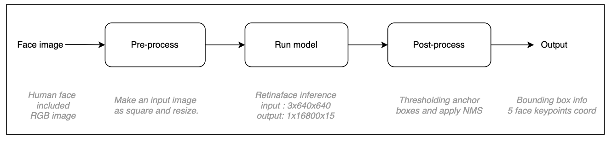
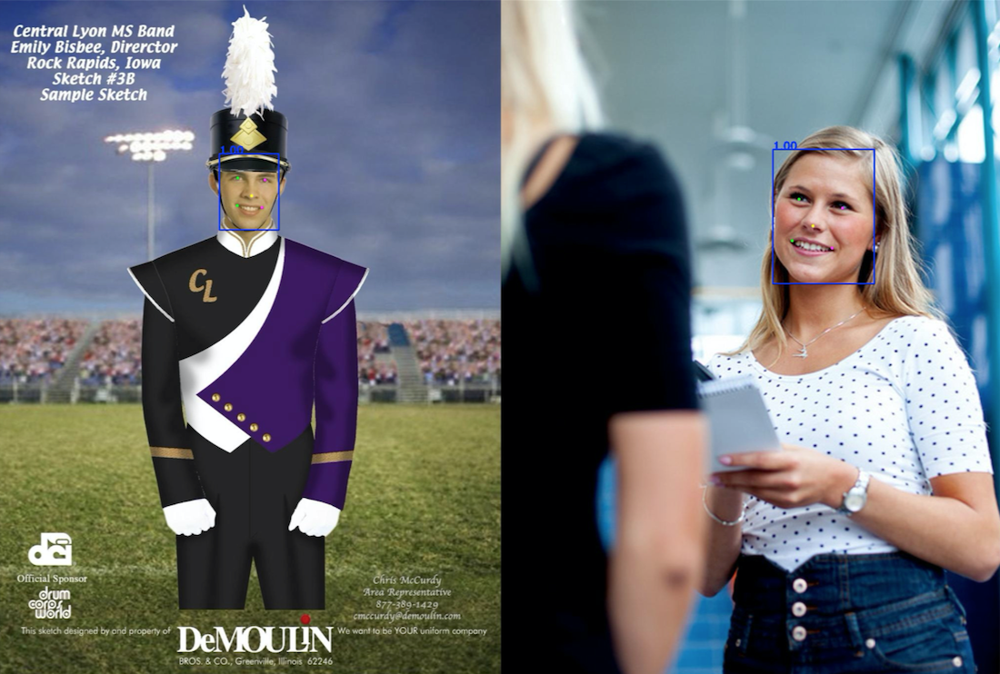

## Introduction

This is a repository to run Retinaface model with OpenCV library in C++

A lots of code lines come from the link [here](https://github.com/linghu8812/tensorrt_inference/tree/master/RetinaFace) for onnx model converting and Retinaface model inference.

## Environments

- This code developed in VisualStudio 2019 with OpenCV(ver 4.5.1)
- only CPU inference supported, GPU acceleration not supported.
- Due to the property of ONNX format, fixed size input required in order to run model

## Overall Pipeline

## Results

## Reference

Deng, Jiankang, et al. "Retinaface: Single-shot multi-level face localisation in the wild." *Proceedings of the IEEE/CVF conference on computer vision and pattern recognition*
. 2020. ([paper](https://openaccess.thecvf.com/content_CVPR_2020/papers/Deng_RetinaFace_Single-Shot_Multi-Level_Face_Localisation_in_the_Wild_CVPR_2020_paper.pdf), [code](https://github.com/deepinsight/insightface/tree/master/detection/retinaface))

[https://github.com/linghu8812/tensorrt_inference/tree/master/RetinaFace](https://github.com/linghu8812/tensorrt_inference/tree/master/RetinaFace)

## Download ONNX model

Pretrained RetinaFace onnx model can be downloaded from the google drive link [here](https://drive.google.com/file/d/1YnM0TlJhuNO5_sS00g1W5ORxlLL227x5/view?usp=sharing)
